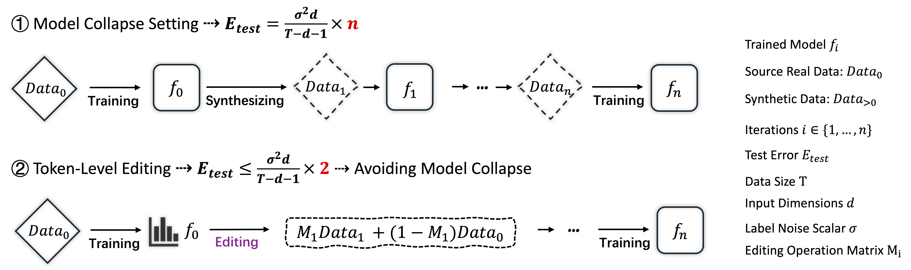

### ToEdit

This repository hosts the official implementation of the methods introduced in our paper "[How to Synthesize Text Data without Model Collapse?](https://arxiv.org/abs/2412.14689)" (ICML 2025). 




## Implementation Details

In our paper, we utilize [OLMo](https://github.com/allenai/OLMo) and [LLaMA-Factory](https://github.com/hiyouga/LLaMA-Factory) for model training. The training data is sourced from:
- [Instruction Pre-Training](https://huggingface.co/instruction-pretrain)
- [Princeton-NLP/less_data](https://huggingface.co/datasets/princeton-nlp/less_data)

For detailed data processing and training procedures, please refer to Appendix F in our paper.

We use [EleutherAI/lm-evaluation-harness](https://github.com/EleutherAI/lm-evaluation-harness) for model evaluation.

## Core Implementation

This repository provides the core implementation of the ToEdit method to facilitate easy migration and adaptation. ToEdit primarily leverages the probability distribution from language models for resampling. Here is the core implementation:

```python
def resampling(prob_dict, num_samples=1, beta=1.5):
    words_candicate = list(prob_dict.keys())
    prob_scores = np.array(list(prob_dict.values()))

    adjusted_probs = softmax(prob_scores / beta) 
    accepted_token = np.random.choice(words_candicate, num_samples, p=adjusted_probs)

    return accepted_token
```

## Usage Example

We provide a Python script for online data editing based on vLLM. The input format is a JSON file (one example per line).

Example command:

```bash
python inference_vllm_rjs_online.py \
    --model_name_or_path /data1/xkzhu/pre_trained_model/Qwen/Qwen2-0.5B-Instruct \
    --tensor_parallel_size 1 \
    --num_shards 8 \
    --shard_index 1 \
    --gpu_memory_utilization 0.8 \
    --test_file data/bio/instruction_biomed \
    --output_dir probability/instruction_biomed—1B-low_drop_up_revise/ \
    --n_of_candicant 64 \
    --batch_size 100 \
    --strategy low_drop_up_revise
```

**Parameter Descriptions:**
- `--model_name_or_path`: Path to the pre-trained model.
- `--tensor_parallel_size`: Number of tensor parallel processes.
- `--num_shards`: Total number of data shards.
- `--shard_index`: Index of the current shard (for distributed processing).
- `--gpu_memory_utilization`: Fraction of GPU memory to use (e.g., 0.8).
- `--test_file`: Path to the input JSON file.
- `--output_dir`: Directory to save the output results.
- `--n_of_candicant`: Number of candidate tokens to consider.
- `--batch_size`: Batch size for inference.
- `--strategy`: Editing strategy to use.

